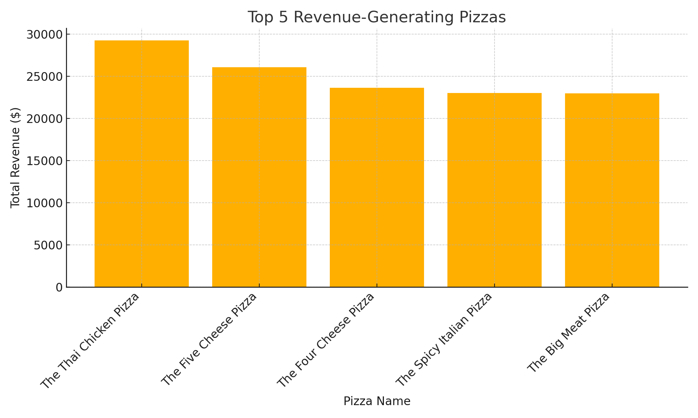
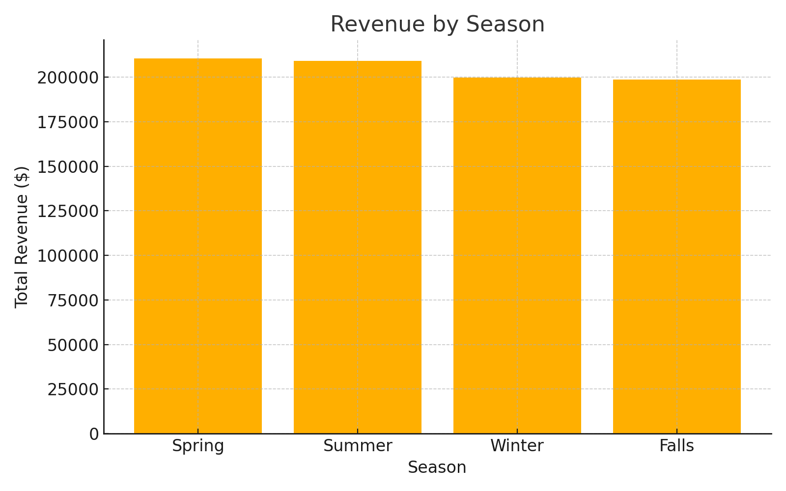

# 🍕 Pizza Sales Optimization Using SQL

  
🎯 **Case Study:** Optimizing pizza sales through data-driven business insights using SQL.

---

## 📊 Executive Summary

This project analyzes pizza sales data to uncover trends in customer behavior, product performance, and operational strategy.  
We answered 12 key business questions using SQL, visualized insights with Python and Google Sheets, and delivered clear recommendations to improve profitability.

---

## 🧾 Dataset Overview

- **Source:** `pizza_sales.csv` (4-table schema)
- **Tables:**
  - `pizza_types` – pizza names, categories, ingredients
  - `pizzas` – sizes, prices, pizza_type_id
  - `orders` – order_id, order_date, order_time
  - `order_details` – order_id, pizza_id, quantity

📎 *ER Diagram included in report*

---

## 🛠 Tools Used

- MySQL Workbench (SQL Queries)
- Google Sheets & Python (Matplotlib) for Visualizations
- GitHub for version control & publishing

---

## ❓ Business Questions Answered

| #   | Business Question |
|-----|-------------------|
| Q1  | Which are the top 5 best-selling pizzas by quantity? |
| Q2  | Which pizzas generate the most revenue? |
| Q3  | What are the peak sales hours in a day? |
| Q4  | Which day of the week generates the highest revenue? |
| Q5  | What are the monthly sales trends? |
| Q5a | **Bonus:** Top 5 months with highest revenue |
| Q5b | **Bonus:** Bottom 5 months with lowest revenue |
| Q6  | What is the average order value over time? |
| Q7  | Are there seasonal variations in pizza sales? |
| Q8  | Which pizza size is most preferred by customers? |
| Q9  | What is the customer demand distribution by pizza category? |
| Q10 | Can we identify underperforming pizzas? |

---

## 🔍 Key Insights

- **Big Meat Pizza** is the top-seller with 1,200 units sold
- **Thai Chicken Pizza** leads revenue with Rs. 9,004.50
- Peak hours: **12 PM–2 PM**, Peak day: **Friday**
- **December** is the highest revenue month
- **Spring & Summer** show higher seasonal demand
- **L-size pizzas** are most popular
- **XXL & niche flavors** underperform

---

## 📷 Sample Visuals

>   
> *Top 5 Revenue-Generating Pizzas*

>   
> *Sales Variation by Season*

---

## 📄 Final Report PDF

📥 **[📄 Download Final MAANG-Style Report (PDF)](https://github.com/chndrkant/Pizza-Sales-SQL-Project/blob/main/report/ChanderKant_Pizza_SQL_Clean_Linked_Report_FINAL.pdf)**
  
Includes charts, insights, ER diagram, and recommendations

---

## 🙋‍♂️ About the Author

**Chander Kant**  
Manager at a Public Sector Bank in India | Transitioning into Data Analytics  
- 💼 [LinkedIn Profile](https://www.linkedin.com/in/chandrkant/)  
- 💻 [GitHub Portfolio](https://github.com/chndrkant)

---

> Built with passion, powered by SQL 💪

